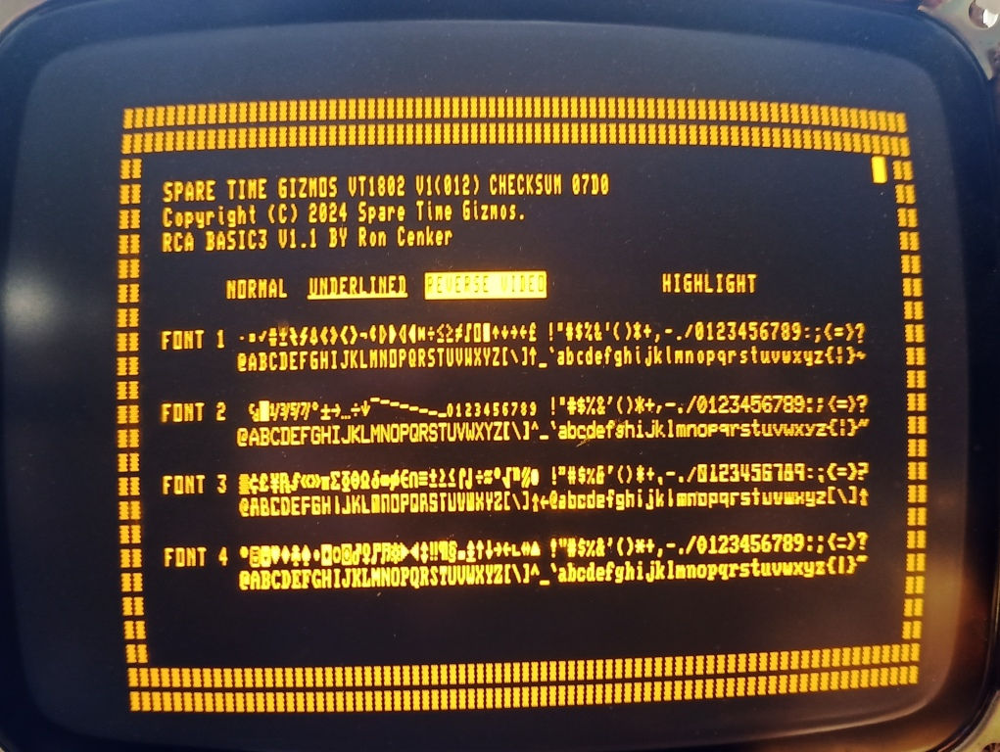

# VT1802

  The VT1802 is a stand alone serial ASCII terminal based on the CDP1802 CPU and the Intel i8275 CRT controller chip.  The VT1802 generates a 80x26 character monochrome text display.  Four different fonts and four character atrributes - reverse video, underline, blinking, and highlight - are supported.  Additionally, the i8275 and VT1802 supports simple drawing codes that can display straight lines, corners, intersections, and simple boxes.

  The VT1802 uses a CDP1854 UART and a CDP1863 baud rate generator.  It can operate at all standard rates from 110 to 9600bps, and can use either CTS/DTR hardware flow control or XON/XOFF software flow control.  A PS/2 keyboard is used for input, and an AT89C4051 auxiliary processor decodes the PS/2 prototocol to generate ASCII key codes.

  The VT1802 contains a second CDP1863 driving a simple two transistor amplifier and speaker.  This can be used to play simple musical tunes.

  The VT1802 firmware also contains a copy of the RCA BASIC3 interpreter and can operate in local mode as a stand alone BASIC computer.  Up to 28K of RAM is available to BASIC for storing programs and data, and programs can be uploaded to or downloaded from a host computer over the serial port using the XMODEM protocol.
  The VT1802 BASIC has been extended to include functions that allow input and output to be redirected to either the serial port or to the PS/2 keyboard and VT display.  A BASIC PLAY statement allows playing of simple music using the VT1802 sound generator, and the BASIC TIME and WAIT functions keep track of the time of day using VRTC interrupts.   And lastly, a BASIC KEY function allows for non-blocking console input from either the serial port or PS/2 keyboard.

